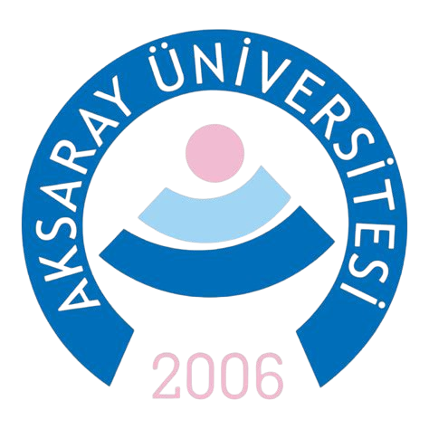
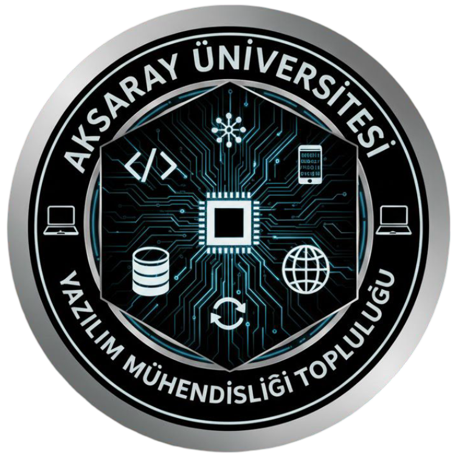

# AKSARAY ÜNİVERSİTESİ YAZILIM MÜHENDİSLİĞİ TOPLULUĞU 2025 – 2026 GÜZ DÖNEMİ ETKİNLİK RAPORU

   

## İçindekiler
- SUNUŞ
- HAKKIMIZDA VE VİZYON
  - KURULUŞ AMACI
  - MİSYONUMUZ
  - VİZYONUMUZ
- YÖNETİM VE ORGANİZASYON ŞEMASI
  - TOPLULUK DANIŞMANI
  - YÖNETİM KURULU
  - KOMİTELER
- DÖNEM İÇİ FAALİYETLER
  - DÖNEM KARNESİ
  - FAALİYET KATEGORİLERİ VE DAĞILIM
  - 2025 - 2026 GÜZ DÖNEMİ - ETKİNLİKLER VE FAALİYETLER
  - 1 - YAZILIM MÜH. SINIFLARI ZİYARETLERİ
  - 2 - YAZILIM MÜHENDİSLİĞİ TOPLULUĞU 1. BULUŞAMASI
  - 3 - ASÜ İĞDE FESTİVALİ
  - 4 - KAHVALTI VE AT BİNME SOSYAL ETKİNLİĞİ
  - 5 - YAPAY ZEKA GRUBU BULUŞMASI
  - 6 - GITHUB, COPILOT VE WEB PUBLISHING SUNUMU
  - 7 - SİNEMA VE MOTİVASYON ETKİNLİĞİ
  - 8 - ANKARA 21. GENÇ AKADEMİ (BİLKENT ÜNİVERSİTESİ)
  - 9 - KONYA GDG DEVFEST 2025 (SELÇUK ÜNİVERSİTESİ)
  - 10 - MÜHENDİSLİK LİDERLERİ 1. KOORDİNASYON TOPLANTISI
- SAYILARLA GÜZ DÖNEMİ (İSTATİSTİKLER)
- KAPANIŞ VE TEŞEKKÜR
  - İLETİŞİM

   

## SUNUŞ

Aksaray Üniversitesi Yazılım Mühendisliği Topluluğu (ASÜ‑YMT) olarak 2025 güz döneminde bölüm öğrencilerimizin akademik ve mesleki gelişimini destekleyen, aynı zamanda topluluk içi etkileşimi artıran etkinlikler gerçekleştirdik. Dönem kapsamında yeni üyelerle tanışma ve bilgilendirme buluşmaları, sosyal kaynaşma etkinlikleri ve teknik içerikli sunumlar düzenlenmiştir. Teknik tarafta GitHub ekosistemi, VS Code entegrasyonu, GitHub Copilot ve web yayınlama gibi güncel araçlar hakkında bilgilendirme yapılmış; ayrıca yapay zeka/makine öğrenmesi ile robotik/gömülü sistemler alanlarında ilgi grubu buluşmaları planlanarak çalışma gruplarının temelleri atılmıştır. Etkinlikler ile öğrencilerimizin networking yapması, ortak proje fikirleri üretmesi ve güncel teknoloji araçlarını tanıması hedeflenmiş; bir sonraki dönemde daha kapsamlı atölye ve proje odaklı çalışmaların yapılması planlanmıştır.

Not: Topluluğumuzun 2025–2026 Güz Dönemi faaliyet raporu; 20.01.2026 tarihi itibarıyla başta topluluk danışmanı Sayın Arş. Gör. Beyza Nur AKŞİT olmak üzere Mühendislik Fakültesi Dekanlığına ve Sağlık, Kültür ve Spor Daire Başkanlığına sunulmak üzere hazırlanmıştır.

Mehmet Akif AKKOÇ
ASÜ Yazılım Mühendisliği Topluluk Başkanı

   

## HAKKIMIZDA VE VİZYON

### KURULUŞ AMACI

Aksaray Üniversitesi öğrencilerinin yazılım mühendisliği alanındaki teorik ve pratik bilgilerini artırmak, sektörle bağlarını güçlendirmek, sosyal ve profesyonel gelişimlerine katkıda bulunmak amacıyla Ekim 2025 tarihinde kurulmuştur.
- Disiplinler arası projeler üreterek ulusal platformlarda başarı hedeflemek ve Aksaray Üniversitesi'ni teknoloji alanında tanınır bir marka haline getirmek.
- Sektörün gerçek problemlerine çözüm üreten, teoriyi pratiğe döken ve portföyünü daha mezun olmadan oluşturan bireyler yetiştirmek.
- Teknopark ve kuluçka merkezleriyle aktif iş birlikleri geliştirerek, öğrenci projelerinin ticarileşebilen girişimlere dönüşmesine öncülük etmek.

### MİSYONUMUZ

Yazılım ve teknolojiye ilgi duyan öğrencilerin bir araya gelerek bilgi ve tecrübelerini paylaşmalarını, birlikte öğrenmelerini, projeler geliştirmelerini ve kendilerini geleceğe en iyi şekilde hazırlamalarını sağlamak.

### VİZYONUMUZ

Üniversitemizden mezun olan öğrencilerin, teknoloji sektöründe fark yaratan, problem çözme yeteneği yüksek, özgüvenli ve "üreten" bireyler olarak tanındığı; Aksaray Üniversitesi'nin adını ulusal platformlarda başarıyla temsil eden, yenilikçi ve öncü bir teknoloji topluluğu olmaktır.

   

## YÖNETİM VE ORGANİZASYON ŞEMASI

### TOPLULUK DANIŞMANI

Arş. Gör. Beyza Nur AKŞİT

ASÜ Yazılım Mühendisliği Topluluğu’nun (ASÜ-YMT) kuruluşuna öncülük eden ve akademik danışmanlığını üstlenen Beyza Nur Akşit; topluluğun sadece sosyal bir grup değil, aynı zamanda teknik bir üretim merkezi olmasını hedeflemektedir.

Akademik Profili ve Uzmanlık Alanları: Aksaray Üniversitesi Mühendislik Fakültesi Yazılım Mühendisliği Bölümü’nde görev yapan Beyza Nur Akşit, akademik çalışmalarını özellikle geleceğin teknolojileri üzerine yoğunlaştırmıştır. Başlıca uzmanlık alanları şunlardır:
- Yapay Zeka ve Derin Öğrenme: Veri analitiği ve akıllı sistemler üzerine teknik çalışmalar yürütmektedir.
- Sağlıkta Yapay Zeka: Yapay zekanın hastalıkların teşhis ve tedavi süreçlerindeki rolü üzerine araştırmalar yapmakta, bu konuda ulusal düzeyde (TÜBİTAK, İHA gibi mecralarda yer alan) görüş ve projeleri bulunmaktadır.
- Federe Öğrenme (Federated Learning): Özellikle medikal verilerin gizliliğini koruyarak makine öğrenmesi modelleri geliştirilmesi üzerine yayımlanmış akademik çalışmaları mevcuttur.

Topluluktaki Rolü ve Vizyonu: ASÜ Yazılım Mühendisliği Topluluğu’nun (ASÜ-YMT) kuruluşuna öncülük eden ve akademik danışmanlığını üstlenen Beyza Nur Akşit; topluluğun sadece sosyal bir grup değil, aynı zamanda teknik bir üretim merkezi olmasını hedeflemektedir.

### YÖNETİM KURULU

Yönetim kurulu ve kurucu üyeler yazılım mühendisliği 2. sınıf öğrencileridir.

- Başkan : Mehmet Akif AKKOÇ
- Başkan Yardımcısı : Halil Temur
- Sayman: Zeynep CANBULUT

- Kurucu Üyeler :
  - Mehmet Akif AKKOÇ
  - Halil TEMUR
  - Mert ÇELİK
  - Recep BEYDÜZ
  - Burak ARIKAN
  - Emir FETOLMAZ
  - Şifa TÜZEL
  - Zeynep CANBULUT
  - Ömür Faruk DURU
- Yönetim Kurulu Üyesi
  - Hakan ULUÇAR
  - Buse Yağmur ÖZDİL

- Denetleme Kurulu
  - Ömür Faruk DURU
  - Burak ARIKAN
  - RECEP BEYDÜZ

### Alt Kurullar

- Etkinlikler Komitesi
  - Zeynep CANBULUT
- Sosyal İlişkiler ve Medya Komitesi
  - Komite Direktörü
    - Mert ÇELİK
  - Web sitesi Ekibi
    - Emir FETOLMAZ
    - Burak ARIKAN
    - Utkan Kutat DORA
  - ®İnsagram
    - Belinay Denek
  - Tasarım ve Montaj
    - Ali Arda Aydın
    - Recep BEYDÜZ
    - Belinay Denek
    - Mert Çelik
- Yapay Zeka Grubu
  - Buse Yağmur ÖZDİL

   

## DÖNEM İÇİ FAALİYETLER

Aksaray Üniversitesi Yazılım Mühendisliği Topluluğu (ASÜ‑YMT), kuruluşunu takiben geçirdiği ilk dönem olan 2025–2026 Güz Dönemi'nde; kurumsal yapılanmasını tamamlamış, teknik yetkinlik artırma ve sosyal etkileşim hedefleri doğrultusunda yoğun bir faaliyet programı yürütmüştür.
Bu bölümde, dönem boyunca 10 haftada gerçekleştirilen 8 ana etkinlik ve 14 yönetim toplantısının genel bir panoraması sunulmaktadır. Faaliyetler planlanırken; Eğitim, Sosyal Etkileşim ve Teknoloji Odak Grupları (Yapay Zeka, Robotik vb.) olmak üzere üç ana stratejik eksen belirlenmiş; her bir etkinliğin öğrenim çıktıları ve katılımcı profili titizlikle kayıt altına alınmıştır.
Aşağıdaki veriler, topluluğun kısa sürede oluşturduğu sinerjiyi ve organizasyonel kapasiteyi özetlemektedir.

### DÖNEM KARNESİ
METRİK: DEĞER / AÇIKLAMA
Toplam Etkinlik Sayısı: 10 (Ana Faaliyet), 14 (Yönetim Toplantısı)
Toplam Tahmini Erişim: 650+ Öğrenci Teması (Sunumlar ve Stant dahil)
En Yüksek Katılımlı Etkinlik: İğde Festivali (~300 kişi)
Toplam Faaliyet Süresi: 40+ saat (Yönetim toplantıları hariç)
ilave olarak 16 Saat İğde Festivali
Üretilen Dijital Varlıklar: GitHub Organizasyonu, Resmi Web Sitesi, Eğitim Repoları ve Teknik yol haritaları

### FAALİYET KATEGORİLERİ VE DAĞILIM
KATEGORİ: DEĞER / KATILIMCI SAYISI
Teknik Yetkinlik ve Akademik Gelişim: %30 (GitHub Sunumu, Yapay Zeka Grubu, Teknik Geziler)
Tanıtım ve Üye Kazanımı: %30 (Sınıf Ziyaretleri, 1. Buluşma, İğde Festivali)
Sosyal Etkileşim: %25 (Kahvaltı/At Binme, Sinema Etkinliği)
Üretilen Dijital Varlıklar: %15 (Mühendislik Liderleri Toplantısı, Ankara/Konya Delegasyonları)

### 2025 - 2026 GÜZ DÖNEMİ - ETKİNLİKLER VE FAALİYETLER

TARİH / ETKİNLİK İSMİ
07 Ekim 2025: Topluluk Sunumu : Yazılım Mühendisliği 2. Sınıf
08 Ekim 2025: Topluluk Sunumu : Yazılım Mühendisliği 1. Sınıf
13 Ekim 2025: ASÜ Yazılım Mühendisliği Topluluğu 1. buluşaması
15 -16 Ekim 2025: ASÜ İğde Festivali Standı
17 Ekim 2025: Kahvaltı ve At Binme Etkinliği
3 Kasım 2025: Yapay Zeka Grubu Toplantısı
5 Kasım 2025: GitHub, Copilot & Web Publishing Sunumu
5 Aralık 2025: Sinema Etkinliği
13-14 Aralık 2025: Ankara 21. Genç Akademi (Bilkent Üniversitesi)
19 Aralık 2025: Konya GDG Konya Devfest (Selçuk Üniversitesi)
25 Aralık 2025: 1. Mühendislik Liderleri Koordinasyon Toplantısı

   

### 1 - YAZILIM MÜH. SINIFLARI ZİYARETLERİ

Etkinlik Türü: Sunum - Tanıtım
Yer:  ASÜ Mühendislik Fakültesi Derslikleri (Yazılım Müh. Sınıfları)
Tarih – Saat: 07.10.2025 (2. Sınıflar, ~10 dk)
              08.10.2025 (1. sınıflar, ~10 dk)

Düzenleyen: Topluluk Yönetimi
Katılımcı Sayısı / Katılımcı Profili: 120 / (1. ve 2. sınıf Yazılım Mühendisliği öğrencileri)
Katılım Şekli: Sınıf içi (ders başlangıcı)

Etkinlik Özeti: Topluluğumuzun resmi kuruluşunun hemen ardından, hedef kitlemize doğrudan ulaşmak amacıyla Yazılım Mühendisliği bölümü dersliklerinde tanıtım sunumları gerçekleştirilmiştir. 07.10.2025 tarihinde 2. sınıf öğrencilerine, 08.10.2025 tarihinde ise 1. sınıf öğrencilerine ders başlangıçlarında ziyaret gerçekleştirilmiş; topluluk yönetimi tarafından yaklaşık 10'ar dakikalık topluluk hakkında bilgilendirme yapılmıştır.

Amaç ve Kapsam: Bu sunumların temel amacı, bölüm öğrencilerinde "Aksaray Üniversitesi Yazılım Mühendisliği Topluluğu" (ASÜ-YMT) hakkında farkındalık oluşturmak ve topluluğun kuruluş vizyonunu ilk elden aktarmaktır. Öğrencilerin akademik ve sosyal gelişimlerine katkı sunacak bu yeni yapıya davet edilmesi ve topluluk iletişim kanallarına (WhatsApp, Instagram vb.) katılımlarının sağlanması hedeflenmiştir.

İçerik Özeti:
- Topluluk Tanıtımı, kuruluş amacı, "birlikte öğrenme ve üretme" felsefesi
- Faaliyet Alanları, planlanan teknik eğitimler, projeler ve sosyal etkinlikler hakkında
- Yönetim ve komiteler hakkında
- Üyelik/iletişim kanalları ve kısa SSS
- Soru / cevap bölümü

Kazanımlar:
- Öğrencilerin topluluk hakkında temel bilgi edinmesi
- Yeni üye/ilgi beyanlarının toplanması
- İleriki dönem etkinlikleri için potansiyel gönüllülerin belirlenmesi

Görseller ve Medya: ...

   

### 2 - Yazılım Mühendisliği Topluluğu 1. Buluşaması

Etkinlik Türü: Tanıtım / Tanışma / Bilgilendirme Semineri
Yer: Tanıtım / Tanışma / Bilgilendirme Semineri
Tarih – Saat: 13.10.2025 – 13:30 / ~1.5 saat
Düzenleyen: Topluluk Yönetimi
Etkinlik Sorumlusu: Topluluk Başkanı - Mehmet Akif AKKOÇ ve Yönetim Kurulu
Katılımcı Sayısı / Katılımcı Profili: ~50 öğrenci / Mühendislik Fakültesi Öğrencileri
Katılım Şekli: Açık katılım

Etkinlik Özeti: Topluluğumuzun resmi kuruluşunun ardından gerçekleştirilen bu ilk geniş kapsamlı buluşmada; ASÜ-YMT’nin kurumsal kimliği, "birlikte öğrenme ve üretme" felsefesi ve dönemlik yol haritası katılımcılara aktarılmıştır. Yazılım Mühendisliği öğrencileri başta olmak üzere fakültenin farklı disiplinlerinden gelen öğrencilerin bir araya geldiği etkinlikte, yönetim kurulu ve komite yapıları tanıtılmış, yeni üyelik süreçleri başlatılmıştır.

Amaç ve Kapsam: Fakülte öğrencilerine topluluğu tanıtarak yeni üye katılımını teşvik etmek ve yazılım mühendisliği alanında disiplinler arası bir sinerji oluşturmaktır. Bu kapsamda:
- Topluluğun "Etrafındakilerin ortalaması kadarsın" felsefesi çerçevesinde, bilgi ve deneyim paylaşımına dayalı bir ekosistem oluşturma hedefi paylaşılmıştır.
- Öğrencilerin akademik ve sosyal gelişimlerine katkı sunacak projeler, eğitimler ve sosyal faaliyetler hakkında farkındalık oluşturulması hedeflenmiştir.

İçerik Özeti: Topluluğun vizyon ve misyon sunumu; kuruluş hikayesi, hedefleri ,vizyonu anlatıldı.
- Organizasyon yapısı ve görev dağılımı; yönetim kurulu, komitelerinin görev tanımları
- Dönem Planlaması; Güz dönemi için planlanan teknik eğitimler ve sosyal etkinlikler
- Soru-Cevap: beklentiler dinlendi, ekipler ve roller üzerinde konuşuldu

Kazanımlar:
Topluluğun vizyon ve misyon sunumu; kuruluş hikayesi, hedefleri ,vizyonu anlatıldı.
- Organizasyon yapısı ve görev dağılımı; yönetim kurulu, komitelerinin görev tanımları
- Dönem Planlaması; Güz dönemi için planlanan teknik eğitimler ve sosyal etkinlikler
- Soru-Cevap: beklentiler dinlendi, ekipler ve roller üzerinde konuşuldu

Görseller ve Medya: ...

   

###  3 - ASÜ İĞDE FESTİVALİ

Etkinlik Türü: Stant / Tanıtım / Sosyal Etkinlik
Yer: ASÜ Kampüs Festival Alanı
Tarih – Saat: 15.10.2025 – 16.10.2025 (2 Gün)
Organizasyon Sahipliği: ASÜ Rektörlüğü (SKS Daire Başkanlığı)
Etkinlik Sorumlusu: Topluluk Yönetim Kurulu
Katılımcı Sayısı / Katılımcı Profili: 200+ Doğrudan Etkileşim ~300 Erişim (Öğrenciler, Akademisyenler, İdari Personel)
Katılım Şekli: Açık Alan / Stant Ziyareti

Etkinlik Özeti: Topluluğumuzun kuruluşunun hemen akabinde, üniversitemiz genelinde düzenlenen İğde Festivali için Sağlık, Kültür ve Spor Daire Başkanlığı'na özel başvuru yapılarak stant açılmıştır. İki gün süren festival boyunca yönetim kurulu ve komite üyeleri dönüşümlü olarak görev alarak yoğun bir çalışma sergilemiştir.
Standımız, klasik broşür dağıtımının ötesine geçerek "üreten topluluk" vizyonunu yansıtacak şekilde tasarlanmıştır. Ziyaretçilere şu aktiviteler sunulmuştur:
- Ödüllü Konsol Oyunu: Üyelerimizin geliştirdiği oyunun canlı demosu yapılmıştır.
- Gömülü Sistem Projesi: Sensörlerle çalışan "Uzaklık Tahmin Oyunu" sergilenmiş ve teknik altyapısı anlatılmıştır.
- Bilgi Yarışması: Teknoloji ve yazılım konulu ödüllü soru-cevap etkinlikleri düzenlenmiş, kazananlara sticker ve çeşitli hediyeler verilmiştir.

Amaç ve Kapsam: Topluluğun henüz yeni kurulmuş olması nedeniyle öncelikli amaç, "Aksaray Üniversitesi Yazılım Mühendisliği Topluluğu" markasının kampüs genelinde görünürlüğünü sağlamaktır. Sadece yazılım bölümü öğrencilerine değil, teknolojiye ilgi duyan farklı disiplinlerdeki öğrencilere ve akademisyenlere ulaşarak üye ağını genişletmek ve disiplinler arası bir etkileşim ortamı yaratmak hedeflenmiştir.

İçerik Özeti:
- Topluluk vizyonunun ve dönem içi planların (atölye, proje vb.) ziyaretçilere birebir anlatılması.
- Üye kayıtlarının alınması; iletişim kanallarına (WhatsApp/Instagram) yönlendirme yapılması.
- Akademisyenler ve idari personel ile tanışarak kurumsal destek zemini oluşturulması.

Kazanımlar:
- Geniş Erişim: Yaklaşık 300 kişilik bir kitleye topluluk ismi duyurulmuş, 200+ kişiyle birebir iletişim kurulmuştur.
- Disiplinler Arası Üyelik: Mühendislik dışındaki fakültelerden teknoloji meraklısı yeni üyeler kazanılmıştır.
- Akademik İlgi: Standı ziyaret eden akademisyenlerden, gelecek etkinlikler ve projeler için destek sözü alınmıştır.
- Ekip Ruhu: Yönetim ve komite üyeleri, yoğun stant nöbetleri sırasında birlikte iş yapma ve kriz yönetimi tecrübesi kazanmıştır.

Görseller ve Medya: ...

   

###  4 - KAHVALTI VE AT BİNME SOSYAL ETKİNLİĞİ

Etkinlik Türü: Sosyal Etkinlik / Gezi / Kaynaşma
Yer: Atlantina At Çiftliği, Merkez / Aksaray
Tarih – Saat: 17.10.2025 – 10:00 – 14:00
Düzenleyen: ASÜ-YMT Yönetim Kurulu 
Danışman: Arş. Gör. Beyza Nur AKŞİT (Refakatçi)
Katılımcı Sayısı / Katılımcı Profili: 40 Öğrenci+ / Yazılım Mühendisliği 1, 2, 3 ve 4. Sınıf Öğrencileri
Katılım Şekli: Kayıtlı

Etkinlik Özeti: Topluluğumuzun kuruluşunu takiben üyelerimiz arasındaki buzları eritmek ve hiyerarşiden uzak samimi bir ortam oluşturmak amacıyla Atlantina At Çiftliği'ne bir ziyaret düzenlenmiştir. Topluluk danışmanımız Arş. Gör. Beyza Nur Akşit’in de katılımıyla gerçekleşen etkinlikte; sabah kahvaltısı eşliğinde başlayan program, at binme deneyimi ve doğa yürüyüşleri ile devam etmiştir.

Amaç ve Kapsam: Etkinliğin öncelikli amacı, bölüme yeni başlayan 1. sınıf öğrencileri ile üst sınıf öğrencileri (özellikle 2. sınıflar) arasında bir tecrübe paylaşım ağı oluşturmaktır. Öğrencilerin akademik yoğunluktan ve sınav stresinden uzaklaşarak sosyal bağlarını güçlendirmesi, samimi ortamda konuşularak ortak ilgi alanlarına sahip kişilerin birbirini tanıması hedeflenmiştir.

İçerik Özeti: 10:00: hareket ve ulaşım.
- Farklı sınıflardan öğrencilerin, tanışma odaklı kahvaltı organizasyonu.
- At Binme Deneyimi: güvenli sürüş teknikleri eğitimi ve at binme aktivitesi.
- Serbest Zaman: Gelecek dönem projeleri beyin fırtınalarının yapıldığı serbest sohbetler.

Kazanımlar: Aidiyet Duygusu: Resmi sınıf ortamı dışında gerçekleşen bu etkinlik, üyelerin topluluğa olan aidiyetini artırmıştır.
- Üst ile alt sınıflar arasında bariyerler kalkmış, akran danışmanlığı süreci başlamıştır.
- Motivasyon: Yoğun eğitim takvimi öncesinde üyeler için motivasyon kaynağı olmuştur.

Görseller ve Medya: ...

   

###  5 - YAPAY ZEKA GRUBU BULUŞMASI

Etkinlik Türü: Tanışma / Grup Toplantısı
Yer: ASÜ Mühendislik Fakültesi Kantini
Tarih – Saat: 03.11.2025 – 13:00 - 14:00
Düzenleyen: Yapay Zeka Grubu Lideri - Buse Yağmur Özdil
Etkinlik Sorumlusu: Yapay Zeka Grubu Lideri - Buse Yağmur Özdil
Katılımcı Sayısı / Katılımcı Profili: 15+ Yapay Zeka, Veri Bilimi ve Makine Öğrenmesi ile ilgilenen üyeler
Katılım Şekli: Açık katılım, kayıt gerektirmeyen oturum

Etkinlik Özeti: 03 Kasım 2025 tarihinde, ASÜ Yazılım Mühendisliği Topluluğu bünyesinde teknik uzmanlaşmayı sağlamak amacıyla oluşturulan "Yapay Zeka ve Makine Öğrenmesi İlgi Grubu"nun ilk temelleri atılmıştır. Mühendislik Fakültesi Kantini'nde gerçekleşen bu samimi buluşmada, alana ilgi duyan üyeler bir araya gelerek tanışmış ve deneyim paylaşımında bulunmuştur. Toplantıda, topluluğun "akran öğrenmesi" (peer-to-peer) felsefesine uygun olarak tecrübeli üyeler ile yeni başlayanlar arasında bir iletişim köprüsü kurulmuştur.

Amaç ve Kapsam: Bu buluşmanın temel amacı, yapay zeka alanında çalışan veya çalışmak isteyen öğrencileri tespit ederek ortak bir sinerji yaratmaktır. Kapsam dahilinde şunlar hedeflenmiştir:
- Networking: Üyelerin birbirini tanıması ve ilgi alanlarına (NLP, Computer Vision, Veri Bilimi vb.) göre gruplandırılması.
- Mentorluk: Tecrübeli üyelerin yeni başlayanlara rehberlik edebileceği alanların belirlenmesi.
- Yol Haritası: Gelecek dönem projeleri için ortak öğrenme kaynaklarının ve çalışma yöntemlerinin netleştirilmesi.

İçerik Özeti:
- Tanışma Turu: Katılımcılar isimlerini, bölümlerini ve yapay zeka alanındaki yetkinlik seviyelerini paylaştı.
- Kaynak Paylaşımı: Öğrenme sürecini hızlandırmak adına "Roadmap.sh (AI/ML Roadmap)" ve matematiksel temeller için "3blue1brown" YouTube kanalı gibi kaynaklar üzerine konuşuldu.
- Proje Fikirleri: Gelecek dönemde yapılabilecek ortak projeler ve katılım sağlanabilecek yarışmalar (Teknofest vb.) tartışıldı.
- İletişim Ağı: Grubun düzenli iletişimi için Discord ve WhatsApp kanallarının aktif kullanımı kararlaştırıldı.

Kazanımlar:
- Yetenek Envanteri Çıkarıldı: Topluluk içindeki yapay zeka potansiyeli haritalandırıldı; NLP, Görüntü İşleme ve Veri Analitiği gibi alt alanlara ilgi duyan üyeler tespit edilerek odak gruplarının zemini hazırlandı.
- Akran Mentorluğu Başlatıldı: "Tecrübeli üyeler" ile "yeni başlayanlar" eşleştirilerek, hiyerarşik olmayan bir bilgi aktarım süreci (peer-to-peer learning) tetiklendi.
- Ortak Öğrenme Kütüphanesi: Dağınık haldeki öğrenme kaynakları yerine, "Roadmap.sh" gibi standartlaştırılmış yol haritaları ve görsel matematik kaynakları (3blue1brown) belirlenerek üyelerin zaman kaybı önlendi.
- Proje Odaklı Kültür: Teorik tartışmaların ötesine geçilerek, Teknofest ve Hackathon gibi somut hedefler için potansiyel ekip arkadaşlıkları kuruldu.
- Sürdürülebilir İletişim Ağı: Fiziksel toplantının ötesinde, haftalık/iki haftalık periyotlarla bir araya gelecek "Bağımsız Çalışma Grubu" yapısı hayata geçirildi.

Görseller ve Medya: ...

   

###  6 - GitHub, Copilot & Web Publishing Sunumu

Etkinlik Türü: Teknik Seminer / Bilgilendirme Sunumu
Yer: Teknik Seminer / Bilgilendirme Sunumu
Tarih – Saat: 05.11.2025 – 15:00 - 16:00
Düzenleyen: Eğitim Komitesi ve Yönetim Kurulu
Etkinlik Sorumlusu: Topluluk Başkanı - Mehmet Akif AKKOÇ
Katılımcı Sayısı / Katılımcı Profili: ~50 Öğrenci / Yazılım Mühendisliği ağırlıklı olmak üzere mühendislik bölümleri
Katılım Şekli: Açık, serbest katılım

Etkinlik Özeti: Dönemin ilk teknik bilgilendirme toplantısı olan bu etkinlikte, modern yazılım geliştirme süreçlerinin merkezinde yer alan GitHub ekosistemi ve yapay zeka destekli kodlama araçları ele alınmıştır. Mühendislik Fakültesi Konferans Salonu'nda gerçekleştirilen sunum, katılımcıların bilgisayar getirmesine gerek duyulmayan "İzle & Öğren" formatında yapılmış; teorik bilgilerin yanı sıra VS Code ve Copilot entegrasyonuna dair canlı demolar gerçekleştirilmiştir.

Amaç ve Kapsam: Bu etkinliğin temel amacı, üyelerimizin sektör standartlarında kullanılan versiyon kontrol sistemleri ve üretkenlik araçlarıyla (AI Tools) erken dönemde tanışmasını sağlamaktır.
- Profesyonel Araçlar: Yazılım projelerinin yönetimi ve ekip çalışması kültürünü aşılamak.
- Yapay zeka destekli kod yazma (AI Coding) araçlarına dair farkındalık oluşturmak.
- Öğrencilerin projelerini internette ücretsiz olarak nasıl yayınlayacaklarını öğretmek.

İçerik Özeti: Bu etkinliğin temel amacı, üyelerimizin sektör standartlarında kullanılan versiyon kontrol sistemleri ve üretkenlik araçlarıyla (AI Tools) erken dönemde tanışmasını sağlamaktır.
- Profesyonel Araçlar: Yazılım projelerinin yönetimi ve ekip çalışması kültürünü aşılamak.
- Yapay zeka destekli kod yazma (AI Coding) araçlarına dair farkındalık oluşturmak.
- Öğrencilerin projelerini internette ücretsiz olarak nasıl yayınlayacaklarını öğretmek.

Kazanımlar: - Profesyonel Geliştirme Kültürü (GitHub & VS Code): Katılımcılar, sektör standartlarında kod yönetiminin temelini oluşturan GitHub ekosistemiyle tanıştı. VS Code entegrasyonu sayesinde, kodun sadece yazılması değil, yönetilmesi ve versiyonlanması gerektiği bilinci, canlı demolarla pratik düzeye taşındı.
- Yapay Zeka Destekli Kodlama (AI-Assisted Coding): GitHub Copilot demosu ile yapay zekanın yazılım mühendisliğindeki dönüştürücü rolü somutlaştırıldı. Öğrenciler, AI araçlarını "kod yazan rakip" değil, "üretkenliği artıran asistan" olarak nasıl konumlandıracaklarını öğrendi.
- Dijital Görünürlük ve Ücretsiz Yayıncılık: "Lokalde çalışan kodun değeri sınırlıdır" vizyonuyla; GitHub Pages ve Cloudflare Pages kullanılarak statik web sitelerinin (HTML/CSS) hiçbir sunucu maliyeti olmadan (hosting) dünyaya nasıl açılacağı teknik olarak öğrenildi. Her üyenin kendi portfolyo sitesini yayınlayabileceği altyapı bilgisi aktarıldı.
- Eğitimde Fırsat Eşitliği (GitHub Education Pack): Öğrencilerin üniversite kurumsal e-postaları (@asu.edu.tr) sayesinde, normalde yüksek maliyetli olan 100’den fazla profesyonel geliştirici aracına (JetBrains IDE'leri, Azure kredileri, Namecheap domain vb.) nasıl ücretsiz erişebilecekleri konusunda farkındalık oluşturuldu ve başvuru süreçleri netleştirildi.
- Teknik Özgüven: Modern araçların (Cloudflare, Git, Copilot) karmaşık görünse de doğru rehberlikle kolayca kullanılabileceği gösterilerek, öğrencilerin yeni teknolojileri deneme konusundaki çekinceleri azaltıldı ve motivasyonları artırıldı.

Görseller ve Medya: ...

   

###  7 - SİNEMA VE MOTİVASYON ETKİNLİĞİ

Etkinlik Türü: Sosyal Etkinlik / Sinema
Yer: Aksaray Merkez, American Life Sinema Salonu
Tarih – Saat: Aksaray Merkez, American Life Sinema Salonu
Düzenleyen: ASÜ-YMT Etkinlik Komitesi
Etkinlik Sorumlusu: Etkinlik Komite Direktörü Zeynep CANBULUT
Katılımcı Sayısı / Katılımcı Profili: 20+ / Yazılım Mühendisliği ve Teknoloji İlgi Alanı
Katılım Şekli: Kayıtlı / Davetli

Etkinlik Özeti: ASÜ Yazılım Mühendisliği Topluluğu'nun sosyal bağları güçlendirmek ve ilham verici bir ortam oluşturmak amacıyla düzenlediği bu etkinlikte, Facebook’un kuruluş hikayesini anlatan The Social Network filmi izlenmiştir. Etkinlik Komitesi tarafından organize edilen buluşma, Aksaray Merkez’de bulunan American Life Sinema Salonu’nda gerçekleştirilmiş; katılımcılara ücretsiz mısır ve içecek ikram edilmiştir. Film gösteriminin ardından yapılan çekilişle bir üyemize İngilizce dil eğitimi desteği sağlanmıştır.

Amaç ve Kapsam: Üyelerinin sınıf ortamı dışında bir araya gelerek iletişimlerini kuvvetlendirmek.
- Vizyon Aktarımı: Bir teknoloji startup'ının doğuş hikayesi üzerinden girişimcilik ve proje geliştirme motivasyonu sağlamak.
- Dil Eğitimine Teşvik: Sponsor destekli ödülle İngilizce eğitiminin önemine dikkat çekmek.

İçerik Özeti: The Social Network filmi ile yazılım dünyasında "fikirden ürüne" giden yolun zorlukları ve rekabet ortamı analiz edildi.
- İkram: Katılımcı konforunu artırmak için mısır ve içecek ikramı yapıldı.
- Yapılan çekilişle 1 kişiye American Life İngilizce Konuşma Pratiği Kursu hediye edildi.

Kazanımlar: Kodlamanın sadece teknik bir iş değil bir girişimcilik aracı olduğunu ilham aldı.
- Moral ve Motivasyon: Yoğun akademik takvim içerisinde üyeler için verimli bir mola ve motivasyon kaynağı oldu.
- Teşvik: İngilizce kursu hediyesi, üyelerin kişisel gelişimine doğrudan katkı sağladı.

Görseller ve Medya: ...

   

###  8 - ANKARA 21. GENÇ AKADEMİ (BİLKENT ÜNİVERSİTESİ)

Etkinlik Türü: Ulusal Zirve / Seminer
Yer: Bilkent Üniversitesi Kampüsü, ANKARA
Tarih – Saat: Bilkent Üniversitesi Kampüsü, ANKARA
Düzenleyen: Bilkent Üniversitesi Operational Research Kulübü
Etkinlik Sorumlusu: 20+ / ASÜ-YMT Üyesi (Yönetim Kurulu ve Aktif Üyeler)
Katılım Şekli: Bireysel Katılım / Delegasyon
Konuşmacı / Danışman: Türkiye’nin önde gelen şirketlerinin C-Level Yöneticileri, Girişimciler ve Yönetim Danışmanları

Etkinlik Özeti: Aksaray Üniversitesi Yazılım Mühendisliği Topluluğu (ASÜ-YMT), yerel faaliyetlerin ötesine geçerek ulusal vizyon kazanmak amacıyla, Türkiye'nin en prestijli öğrenci zirvelerinden biri olan 21. Genç Akademi etkinliğine katılım sağlamıştır. Topluluk üyelerimiz, ulaşım ve konaklama süreçlerini tamamen kendi inisiyatifleri ve bireysel imkanlarıyla organize ederek, kişisel gelişimlerine verdikleri önemi göstermişlerdir. İki gün süren zirve boyunca üyelerimiz; iş dünyasının dinamikleri, dijital dönüşüm, liderlik ve kariyer yönetimi konularında üst düzey yöneticileri dinleme fırsatı bulmuş, fuaye alanlarında farklı üniversitelerden gelen öğrenciler ve şirket temsilcileriyle ağ (network) kurmuşlardır.

Amaç ve Kapsam: Etkinliğin temel amacı, üyelerimizin kampüs sınırlarını aşarak ulusal düzeydeki teknoloji ve iş dünyası atmosferini solumalarını sağlamaktır.
- Vizyon Transferi: Büyük ölçekli bir organizasyonun işleyişini yerinde gözlemleyerek, gelecek dönemde Aksaray Üniversitesi'nde düzenlenecek etkinlikler için organizasyonel tecrübe edinmek.
- Kariyer Farkındalığı: Sektör liderlerinin kariyer hikayelerini dinleyerek, yazılım ve mühendislik dünyasındaki güncel beklentileri anlamak.

İçerik Özeti: Zirve programı, teknik bilgi aktarımının ötesinde "vizyon" ve "liderlik" odaklı oturumlarla zenginleştirilmiştir:
- Liderlik ve Geleceğin Yetkinlikleri Oturumları: Türkiye'nin dev holdinglerinin ve teknoloji şirketlerinin üst düzey yöneticileri (C-Level) tarafından verilen seminerlerde; "Değişen Dünyada Liderlik", "Kriz Yönetimi" ve "Sürdürülebilirlik" konuları işlenmiştir.
- Dijital Dönüşüm ve Teknoloji Panelleri: Yapay zeka, veri analitiği ve dijitalleşmenin iş süreçlerini nasıl dönüştürdüğü üzerine, sektör profesyonellerinin katıldığı interaktif paneller düzenlenmiştir.
- Girişimcilik Hikayeleri: Başarılı start-up kurucularının "fikirden ürüne" giden süreçte yaşadıkları zorluklar ve başarı hikayeleri vaka analizi tadında dinlenmiştir.
- Networking ve Fuaye Alanı: Kahve aralarında ve fuaye alanında, Türkiye’nin dört bir yanından gelen üniversite öğrencileri ve sponsor firma yetkilileri ile birebir tanışma, staj/iş imkanlarını konuşma fırsatı yakalanmıştır.

Kazanımlar: Bu katılım, ASÜ-YMT için sadece bir gezi değil, stratejik bir gelişim adımı olmuştur:
- Vizyon Transferi ve Motivasyon: Üyelerimiz, Türkiye'nin en iyi üniversitelerindeki akranlarıyla aynı ortamı paylaşarak, ASÜ-YMT'nin numaralı kaynağımızda belirtilen "ulusal platformlarda başarı hedefleme" vizyonuna olan inançlarını tazelemişlerdir.
- Organizasyonel Benchmark (Kıyaslama): Bilkent EMT’nin organizasyon yapısı, sponsorluk yönetimi, katılımcı deneyimi tasarımı ve sahne şovları teknik olarak incelenmiş; bu gözlemler ASÜ-YMT’nin gelecek etkinlikleri için birer "know-how" (bilgi birikimi) olarak not edilmiştir.
- Profesyonel Ağ (Networking): Sektör temsilcileri ve diğer üniversite topluluk liderleriyle LinkedIn üzerinden sürdürülebilir bağlantılar kurulmuş, potansiyel ortak projelerin (Hackathon vb.) zemini yoklanmıştır.
- Gönüllülük Bilinci: Üyelerin bu etkinliğe tamamen kendi inisiyatifleri ve bütçeleriyle katılmaları, topluluk içindeki "öğrenme aşkı" ve "fedakarlık" kültürünün en somut göstergesi olarak kayıtlara geçmiştir.

Görseller ve Medya: ...

   

###  9 - Konya GDG Devfest 2025 (Selçuk Üniversitesi)

Etkinlik Türü: Teknik Gezi / Konferans / Networking
Yer: Selçuk Üniversitesi, Konya (Süleyman Demirel Kültür Merkezi)
Tarih – Saat: 19.12.2025 / 09:30 - 17:00 
Düzenleyen: GDG Konya (Google Developer Groups)
Etkinlik Sorumlusu: Mehmet Akif AKKOÇ (Topluluk Başkanı)
Katılımcı Sayısı / Katılımcı Profili: 20 Kişi / ASÜ-YMT Yönetim Kurulu ve Aktif Üyeler
Katılım Şekli: Kayıtlı / Özel Araç (Otobüs) ile Toplu Katılım

Etkinlik Özeti: Aksaray Üniversitesi Yazılım Mühendisliği Topluluğu (ASÜ-YMT), Google teknolojilerine odaklanan ve bölgenin en büyük geliştirici etkinliklerinden biri olan Devfest Konya 2025 etkinliğine katılım sağlamıştır. Etkinlik için topluluk bütçesi ve organizasyonuyla özel bir otobüs kiralanmış, 20 kişilik yönetim ve aktif üye kadrosuyla Selçuk Üniversitesi’ne teknik gezi düzenlenmiştir.

Amaç ve Kapsam: Bu teknik gezinin temel amacı, üyelerimizin kampüs sınırlarını aşarak global teknoloji trendlerini yerinde takip etmelerini sağlamaktır.
- Teknolojik Vizyon: Google Developer Experts (GDE) ve sektör liderlerinden Yapay Zeka (Gemini), Cloud ve Mobile (Flutter) teknolojilerindeki en son yenilikleri öğrenmek.
- Kurumsal İlişkiler: GDG (Google Developer Groups) ekosistemiyle bağları güçlendirmek ve Aksaray’da düzenlenmesi planlanan etkinlikler için organizasyonel tecrübe edinmek.
- Networking: Farklı üniversitelerden gelen geliştiriciler ve fuaye alanındaki teknoloji firmalarıyla birebir temas kurarak staj/iş ağlarını genişletmek.

İçerik Özeti: - Paralel Teknik Oturumlar: Google teknolojileri ekseninde; Üretken Yapay Zeka (Generative AI), Bulut Bilişim (Google Cloud) ve Mobil Geliştirme (Flutter/Android) üzerine teknik sunumlar takip edilmiştir.
- Organizasyonel Gözlem (Backstage): Yönetim Kurulu üyemizin organizasyon ekibinde yer alması vesilesiyle; kayıt masası yönetimi, konuşmacı ağırlama süreçleri ve sahne arkası kriz yönetimi gibi operasyonel detaylar "yerinde" incelenmiştir.
- Networking ve Kariyer Alanı: Fuaye alanındaki şirket stantları ziyaret edilerek staj imkanları sorgulanmış, diğer üniversitelerden gelen topluluk liderleriyle tanışılmıştır.
- Mentorluk Görüşmeleri: Google Developer Experts (GDE) ünvanlı uzmanlarla birebir temas kurularak, sektörün öğrencilerden beklentileri ve kariyer tavsiyeleri üzerine sohbetler gerçekleştirilmiştir.

Kazanımlar: Bu etkinlik, ASÜ-YMT için sadece bir gezi değil, stratejik bir "kilometre taşı" olmuştur:
- Ekosistem Entegrasyonu: Yönetim kurulu üyemizin organizasyondaki rolü ve kalabalık katılımımız sayesinde, GDG Konya ekibiyle güçlü bir köprü kurulmuş; gelecek dönemde "GDG Aksaray" yapılanmasının temellerini atabilecek iş birlikleri konuşulmuştur.
- Operasyonel Yetkinlik: Şehir dışı bir organizasyonun (ulaşım, bütçe, ekip koordinasyonu) sorunsuz yönetilmesi, Yönetim Kurulunun operasyonel kabiliyetini kanıtlamıştır.
- Kurumsal Görünürlük (Marka Bilinci): Etkinliğe bireysel değil, kurumsal kimlikle (topluluk olarak) katılım sağlanması, bölgedeki diğer yazılım toplulukları ve firmalar nezdinde ASÜ-YMT'nin "aktif ve güçlü bir topluluk" olduğu algısını pekiştirmiştir.
- Takım Ruhu ve Motivasyon: Yolculuk süreci ve etkinlik boyunca bir arada hareket eden çekirdek kadro, topluluk içi aidiyet duygusunu en üst seviyeye çıkarmış ve bahar dönemi projeleri için motive olmuştur.

Görseller ve Medya: ...

   

###  10 – MÜHENDİSLİK LİDERLERİ 1. KOORDİNASYON TOPLANTISI

Etkinlik Türü: Koordinasyon Toplantısı / Stratejik Planlama
Yer: Gloria Jean's Cafe, Aksaray Merkez
Tarih – Saat: 25.12.2025 / 17:00 - 18:00
Düzenleyen: ASÜ-YMT Yönetim Kurulu
Etkinlik Sorumlusu: ASÜ-YMT Topluluk Başkanı Mehmet Akif AKKOÇ
Katılımcı Sayısı / Katılımcı Profili: 15 Kişi / Müh. Fak. bünyesindeki 8 topluluğun Yönetim Kurulu Temsilcileri
Katılım Şekli: Davetli (Kapalı Oturum)

Etkinlik Özeti: ASÜ Yazılım Mühendisliği Topluluğu (ASÜ-YMT) öncülüğünde, "Mühendislikte Güç Birliği" mottosuyla fakültemizdeki tüm öğrenci topluluklarını bir araya getiren tarihi bir adım atılmıştır. Mühendislik Fakültesi bünyesindeki 8 farklı topluluğun (Makine, İnovasyon, Siber Güvenlik, EMT, EEM, STEM, STT ve YMT) liderleri, Gloria Jean's Cafe'de düzenlenen "1. Mühendislik Liderleri Koordinasyon Toplantısı"nda bir araya gelmiştir.
"Rekabet değil, dayanışma" kültürünü inşa etmek amacıyla düzenlenen bu zirvede; topluluklar arası iletişim kopukluklarının giderilmesi, kaynakların verimli kullanımı ve bürokratik süreçlerde ortak hareket edilmesi konularında tam mutabakata varılmıştır. Toplantının en önemli çıktısı ise Bahar Dönemi için planlanan ve tüm mühendislik disiplinlerini kapsayacak olan "Büyük Mühendislik Zirvesi" vizyonunun temellerinin atılması olmuştur.

Amaç ve Kapsam: Bu toplantı, fakülte içerisindeki parçalı yapıyı bütünleşik bir "Mühendislik Ekosistemi"ne dönüştürmeyi hedeflemiştir:
- Dayanışma Kültürü: Fakülte toplulukları arasında geçmişte yaşanan iletişim kazalarını gidererek "rekabet" yerine "stratejik ortaklık" anlayışını yerleştirmek.
- Etkinlik Koordinasyonu (Takvim Birliği): Sınırlı sayıdaki salon ve zaman dilimlerini verimli kullanmak adına etkinlik takvimlerini senkronize etmek ve çakışmaları önlemek.
- Bürokratik Güç Birliği: Sağlık, Kültür ve Spor Daire Başkanlığı (SKS) ve Dekanlık süreçlerinde (izinler, araç tahsisi, bütçe) toplulukların ortak hareket ederek taleplerini daha güçlü iletmelerini sağlamak.
- Disiplinler Arası Projeler: Farklı mühendislik dallarının (Yazılım, Makine, Elektrik-Elektronik vb.) bir araya gelerek hibrit projeler ve etkinlikler üretmesinin önünü açmak.

İçerik Özeti: Toplantı gündemi, fakülte içerisindeki öğrenci topluluklarının münferit hareket etmek yerine organize bir güç birliği oluşturması üzerine kurgulanmıştır:
- Mühendislik Masası: Makine, İnovasyon, Siber Güvenlik, EMT, EEM, STEM, STT ve YMT topluluklarının başkanları ve yönetim temsilcileri ilk kez resmi bir gündemle aynı masa etrafında toplandı.
- Sorun Analizi ve Çözüm Ortaklığı: Toplulukların SKS ve Dekanlık süreçlerinde (salon tahsisi, araç isteği, bütçe onayı) yaşadıkları ortak bürokratik zorluklar masaya yatırıldı. Bu süreçlerde toplulukların birbirine referans olması ve "ortak talep" oluşturarak yönetime gitmesi kararlaştırıldı.
- Bahar Dönemi Vizyonu (Büyük Zirve): Tekil etkinliklerin ötesine geçerek; bahar döneminde tüm mühendislik disiplinlerini kapsayan, Aksaray Üniversitesi'nin en geniş kapsamlı **"Büyük Mühendislik Zirvesi"**nin düzenlenmesi fikri tartışıldı ve prensipte kabul edilerek görev dağılımı konuşuldu.
- Çatışmasızlık İlkesi: Geçmiş dönemlerde yaşanan etkinlik tarihi çakışmalarını önlemek adına, topluluk başkanlarının yer aldığı ortak bir dijital takvim ve hızlı iletişim kanalı (WhatsApp Liderler Grubu) oluşturuldu.

Kazanımlar: - Kurumsal Birlik (Ekosistem): Fakülte tarihinde ilk kez 8 farklı topluluk, ASÜ-YMT ev sahipliğinde "rekabet" yerine "dayanışma" ilkesini benimseyerek fiili bir "Mühendislik Toplulukları Birliği" oluşturdu.
- Stratejik Planlama: Bahar dönemi için planlanan büyük zirve ile fakültenin marka değerini yükseltecek en büyük organizasyonun temelleri atıldı; topluluklar arası görev paylaşımı (sponsorluk, operasyon, teknik) için zemin hazırlandı.
- Operasyonel Verimlilik: Etkinlik tarihlerinin ve salon kullanımlarının koordine edilmesi sağlanarak, kaynak israfının ve katılımcı bölünmesinin önüne geçecek "önce haberleş, sonra planla" sistemi kuruldu.
- Sosyal Sermaye: Topluluk liderleri arasındaki iletişim bariyerleri kaldırılarak, kriz anlarında ve ortak projelerde hızlı aksiyon alabilecek güçlü bir sosyal ağ (networking) inşa edildi.

Görseller ve Medya: ...

   

## SAYILARLA GÜZ DÖNEMİ (İSTATİSTİKLER)

- Üye Sayısı: 123
- Topluluğumuzun ilk dönemindeki performansı, sadece niceliksel bir kalabalık değil, aynı zamanda niteliksel bir derinlik ve kurumsal bir temsil gücü oluşturduğumuzu kanıtlamaktadır:
- Doğrudan ve Geniş Erişim: Bölüm içi yapılan sınıf ziyaretleri ile 120 Yazılım Mühendisliği öğrencisine doğrudan ulaşılarak topluluk vizyonu aktarılmış; İğde Festivali süresince ise yaklaşık 300 kişiyle temas kurularak kampüs genelinde marka bilinirliği sağlanmıştır.
- Akademik ve Teknik Derinlik: İlk teknik seminerimiz olan "GitHub & Copilot" sunumuna ~50 öğrenci katılım sağlamış ; teknik odak gruplarının (Yapay Zeka vb.) ilk toplantılarında 15+ kişilik çekirdek çalışma grupları oluşturulmuştur.
- Sosyal Aidiyet ve Bağlılık: Öğrenciler arası hiyerarşiyi kırmak amacıyla düzenlenen Kahvaltı ve At Binme etkinliğine 40'tan fazla üye katılmış ; dönem ortasındaki motivasyon odaklı sinema etkinliğinde ise 20'den fazla katılımcıyla sosyal bağlar pekiştirilmiştir.
- Ulusal Temsil ve Delegasyon: Ankara (Bilkent Üniversitesi) ve Konya (Selçuk Üniversitesi) illerinde düzenlenen ulusal çaplı teknoloji zirvelerine, toplamda 40 kişilik bir öğrenci grubu ile katılım sağlanarak Aksaray Üniversitesi ulusal platformlarda temsil edilmiştir.
- Kurumsal Diplomasi ve Güç Birliği: Fakültedeki 8 farklı mühendislik topluluğu (Makine, Siber Güvenlik, EMT, EEM, STEM, STT, İnovasyon ve YMT) tarihinde ilk kez YMT öncülüğünde bir araya getirilerek ortak bir koordinasyon mekanizması kurulmuştur.
- Dijital Varlık Üretimi: Dönem boyunca topluluğa ait 1 kurumsal web sitesi (asuymt.com), aktif bir GitHub organizasyonu ve üyelerin kullanımına sunulan çeşitli eğitim materyalleri (Roadmapler/Eğitim Repoları) dijital envantere kazandırılmıştır.

### KAPANIŞ VE TEŞEKKÜR

Aksaray Üniversitesi Yazılım Mühendisliği Topluluğu (ASÜ-YMT) olarak, kuruluşumuzun ilk dönemini yüksek verimlilik ve güçlü bir ekip ruhuyla tamamlamış bulunmaktayız. "Üreten üniversite, üreten mühendis" vizyonuyla çıktığımız bu yolda, bizlere destek olan tüm paydaşlarımıza teşekkür ederiz.

Özellikle topluluğumuzun kuruluşuna öncülük eden ve her adımda akademik rehberliğini esirgemeyen Topluluk Danışmanımız Arş. Gör. Beyza Nur AKŞİT'e, salon ve araç tahsisi konularındaki desteklerinden dolayı Mühendislik Fakültesi Dekanlığına ve Sağlık, Kültür ve Spor Daire Başkanlığına şükranlarımızı sunarız.

#### İLETİŞİM

Topluluk faaliyetlerimize dair tüm güncel duyurulara ve teknik dökümanlara aşağıdaki kanallardan ulaşılabilir:

Web Sitesi: https://asuymt.com
Instagram: https://www.instagram.com/asuymt/
GitHub    : https://github.com/asuymt
E-posta    : asuymt2025@gmail.com